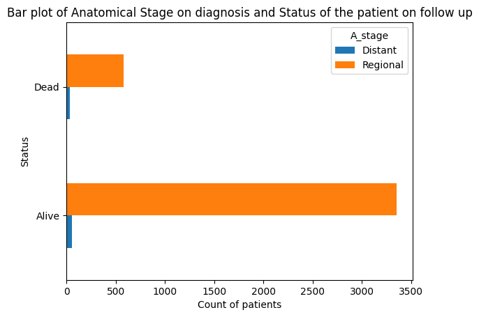

# 1.0 Title

Trends & Insights into Survival in Female Breast Cancer Patients diagnosed between 2006 & 2010, USA: SEER Data
(Pydata_Capstone_Project)

# 1.1 Project description

Analysis of the data to get trends & insights on survival of female breast cancer patients from diagnosis (2006 – 2010) until time of follow up

The data has 15 columns, that were grouped into 3 groups of variables for data analysis:

Group 1 - Patient demographic variables – 3 columns (index 0 - 2)

Group 2 - Disease variables - 3 sub-groups:

  a.  Cancer stage – 3 columns (index 3 - 5)

  b.  Tumour Characteristics – 3 columns (index 6 - 8)

  c.  Hormonal receptor status – 2 columns (index 9  & 10)

  d.  Regional lymph node examination – 2 columns (index 11 & 12)

Group 3 - Patient outcome variables (outcome on follow up as of November 2017) - 2 columns (index 13 &14)

The data columns were also grouped into numerical & categorical variables to be able to determine the analysis method:

1. Numerical columns (int64) – col index 0, 8 & 13
2. Categorical columns (Object) – col index 1 - 7 , 9 - 12 & 14

Data analysis to determine trends and insights into survival of female breast cancer patients entailed the following:

1. Bivariate analysis of the categorical disease variables (cancer stage, tumour characteristics and hormone receptor status columns) and survival months.
2. Bivariate analysis of the categorical disease variables (cancer stage, tumour characteristics and hormone receptor status columns) and status on follow up
3. Bivariate analysis of the numerical disease variables (tumor size, regional node examination,regional node positive) and status in months.
4. Bivariate analysis of the numerical disease variables (tumor size, regional node examination,regional node positive) and survival months.

# 1.2 Description of dataset

Data obtained from <https://ieee-dataport.org/open-access/seer-breast-cancer-data>

This dataset of breast cancer patients was obtained from the **2017 November update** of the SEER Program of the NCI, which provides information on population-based cancer statistics.
The dataset involved female patients with infiltrating duct and lobular carcinoma breast cancer (SEER primary cites recode NOS histology codes 8522/3) **diagnosed in 2006-2010.**
Patients with unknown tumour size, examined regional LNs, positive regional LNs, and patients whose survival months were less than 1 month were excluded; thus, 4024 patients were ultimately included.
The columns in the dataset provide details about the patients' demographics, cancer stage, tumor characteristics, lymph node examination results, hormone receptor status, survival months and survival status.

Key features:

**PATIENT DEMOGRAPHIC VARIABLE**S

**Age:** Age of the patient.

**Race:** Ethnicity of the patient.

**Marital Status:** Marital status at diagnosis.

**DISEASE VARIABLES**

1. **CANCER STAGE**

**T Stage:** Tumor size classification.

**N Stage:** Regional lymph node involvement.

**6th Stage:** Overall cancer stage based on the 6th edition of the AJCC Cancer Staging Manual.

2. **TUMOUR CHARACTERISTICS**
**Grade** Aggressiveness of cancer/how cells differe from the normal breast tissue cell

**A Stage:** Anatomical stage of cancer.

**Tumor Size:** Size of the tumor.

3. **HORMONAL STATUS**

**Estrogen Status:** Estrogen receptor status (positive or negative).

**Progesterone Status:** Progesterone receptor status (positive or negative).

4. **LYMPH NODE EXAMINATION**

**Regional Node Examined:** Number of lymph nodes examined.

**Regional Node Positive:** Number of lymph nodes that tested positive.

**PATIENT OUTCOME VARIABLES**

**Survival Months:** Number of months the patient survived.

**Status:** Whether the patient was alive or dead at the time of follow-up.

# 1.3 Installation

## Installation of the packages

pip install numpy

pip install pandas

## Importation of the required modules

import numpy as np

import pandas as pd

import datetime as dt

import csv

import matplotlib

import matplotlib.pyplot as plt

import seaborn as sns

# 1.4 Usage

See code and findings in breastcancerdatacapstoneproject.ipynb notebook

For the comparison of survival months (numerical) and the categorical disease variables for cancer stage, tumor characteristics, hormonal status, the pandas df.groupby & describe() functions were used to get mean & SD, max, min, quartiles and count. The findings were visualised using seaborn and matplot lib modules to plot violin plots.

For the comparison of survival months (numerical) and the numerical disease variables for tumor size, regional node examined & regional node positive, a dataframe containing the numerical data was created. The dataframe was used to calculate a correlation matrix so as to plot a heat map using seaborn in pandas. In addition, visualization of the findings was done using seaborn and matplot lib modules to plot line plots.

For the comparison of status on follow up and the categorical disease variables for cancer stage, tumor characteristics, hormonal status, the pandas cross tab() function was used to determine the value counts and percents. The findings were visualised using seaborn and matplot lib modules to create bar plots.

For the comparison of status on follow up and the numerical disease variables for tumor size, regional node examined & regional node positive, the pandas df.groupby & describe() functions were used to get mean & SD, max, min, quartiles and count. The findings were visualised using seaborn and matplot lib modules to create box plots and violin plots.

A pair plot was created using seaborn module. 

# 1.5 Findings & Visualization

Survival months for all T Stages - negatively skewed

Survival months for T4 stage - spread out

No difference in survival months across the T Stages

Median survival months for T3 stage - lowest (69 months/5.75 years) versus highest of 75 months for T1

Survival months for all N Stages - negatively skewed

Survival months for N3 stage - spread out.

No difference in survival months across the N Stages

Median survival months for N3 stage - lowest (66 months/5.5 years) versus 75 months for N1 stage

Survival months for all cancer stages - negatively skewed

Survival months for stage III B &  IIIC - spread out.

No difference in survival months across all overall cancer stages 

Median survival months for stage IIIC is the lowest (66 months/5.5 years) vs. 76 months for stage IIA

Survival months for all tumor grades - negatively skewed

Survival months for Grade IV - spread out

Median survival month for Grade III is the lowest (70 months/5.8 years)

No much difference in survival months across grades I, II & III

Survival months for all anatomical stages - negatively skewed

Survival months for distant anatomical stage - spread out

Median survival months for distant anatomical stage is lower (60.5/5 years) than the regional anatomical stage (73/6 years) – difference between the 2

Dataset for regional anatomical stage has 3 modes

Survival months for estrogen receptor (ER) -ve & +ve  - negatively skewed

Survival months for ER -ve - spread out

Median survival months for ER -ve - lower  (64 months/5 years) than ER +ve (73 months/6 months)

Dataset for ER +ve: 3 modes

Dataset for ER -ve: 2 modes

Survival months for progesterone receptor (PR) negative & positive - negatively skewed & spread out

Median survival months for PR–ve lower (69 months/5.75 years) than PR +ve (74 months/6 years)

Dataset for PR +ve: 3 modes

Dataset for PR–ve: 2 modes

Negative correlation between tumor size, number of regional nodes examined & positive regional nodes & survival months

Correlation between regional node positive & regional node examined – further exploration into this in the future

Tumor size in both groups - positively skewed

Tumor sizes for the patient who were dead on follow up - spread out

Median tumor size for the patients who were alive on follow up - smaller (23mm) versus 30mm

No much difference in tumor size across the 2 groups

Most of the patients who were alive on follow up had a tumor size of less than 25mm

Data on number of regional nodes examined in both groups - positively skewed

Median for the 2 groups is the same (14)

No difference between the 2 groups

Data on +ve regional nodes examined in both groups - positively skewed

Median number of +ve regional nodes for patients alive on follow up is smaller (2) versus 4

Most of the patients alive on follow up - low numbers of +ve regional nodes

Data on +ve regional nodes for patients who were dead on follow up - spread out

## Overall findings

**Trends in survival month**s

Longest median survival months: T1 stage, N1 Stage, Stage IIA & Grade IV

Patients with +ve estrogen & progesterone receptor status, regional anatomic stage had longer survival months

Possible relationship between lower survival months & many positive regional lymph nodes

**Insights into status on follow up**

Cancer stage for patients alive on follow up was stage IIA versus stage IIIA & IIIC for patients dead on follow up

Tumor size for patients alive was smaller (23mm) versus 30mm in those dead

There were more patients alive with estrogen receptor +ve status (95.3%) versus progesterone receptor status +ve (85.5%)

Most of the patients alive on follow up had low numbers of +ve regional nodes

# 1.5 Acknowledgements/Attributions

1. IEEE DATAPORT - <https://ieee-dataport.org/open-access/seer-breast-cancer-data>
